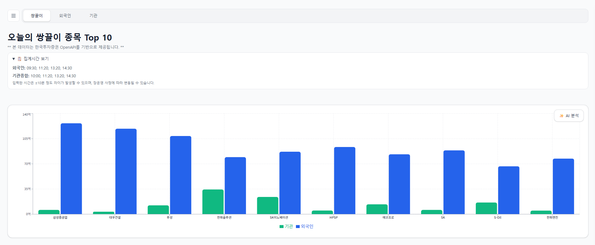
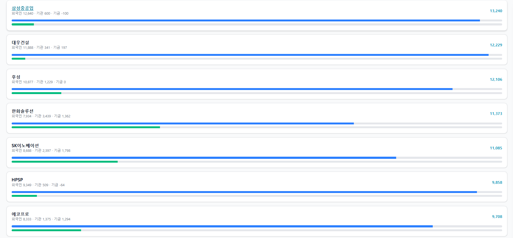
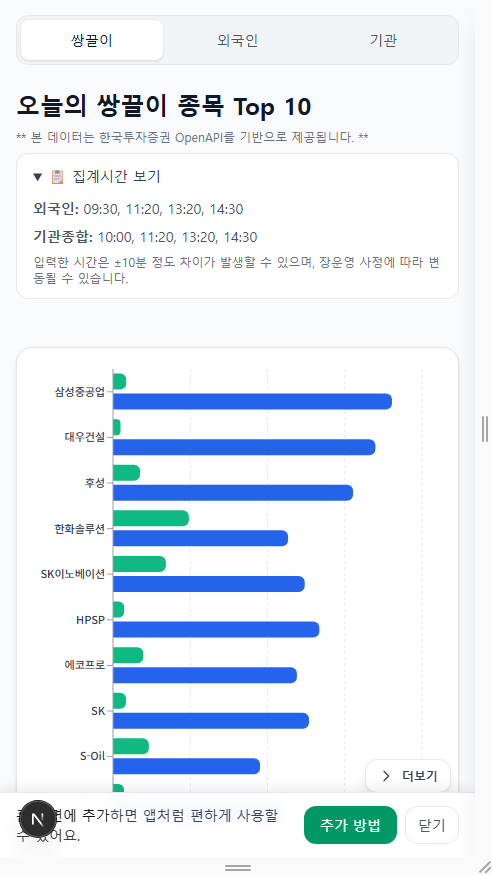
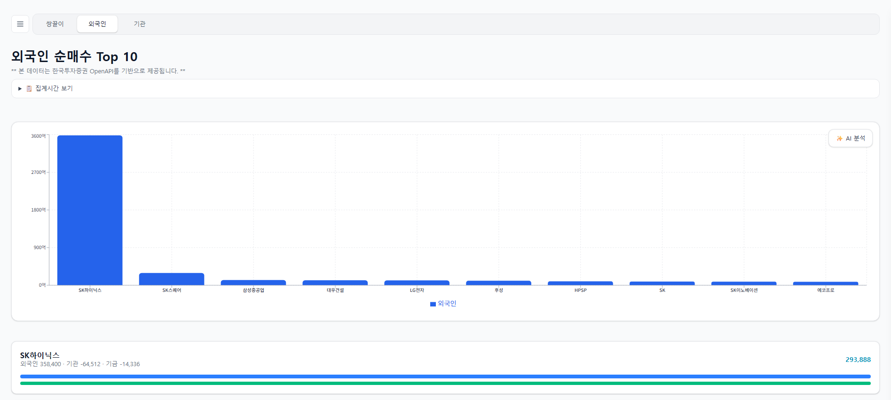
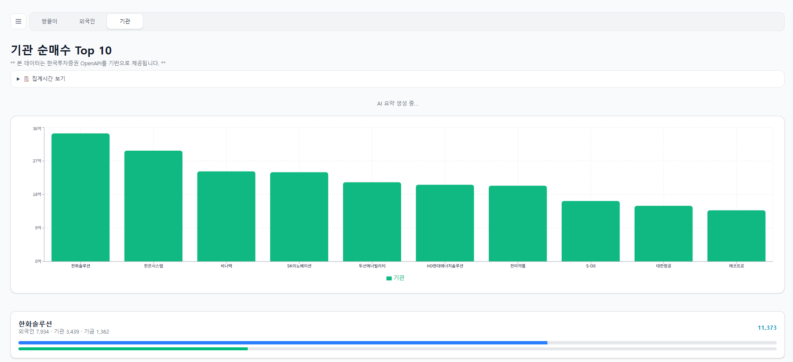
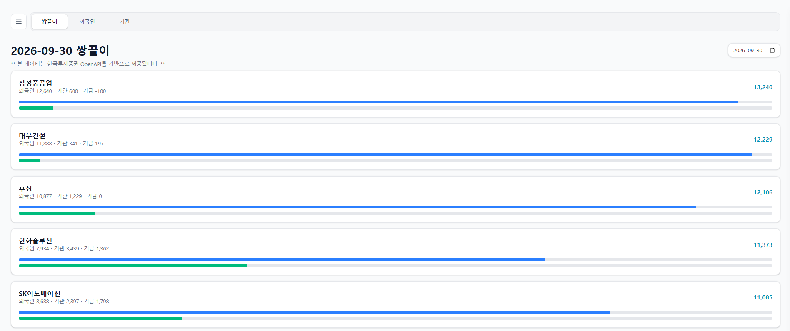
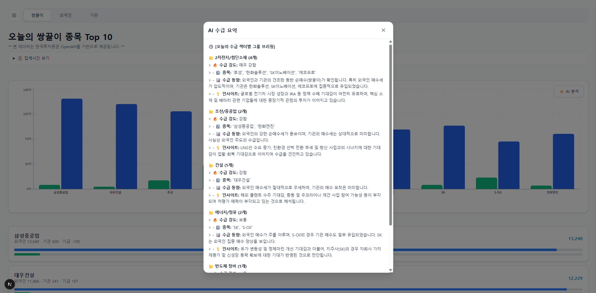

# 오늘의 쌍끌이

> 한국투자증권 Open API의 외국인·기관 수급 데이터를 수집·가공하고,  
> 외국인과 기관의 동시 순매수(쌍끌이) 종목을 한눈에 확인할 수 있도록 만든 주식 수급 분석 서비스입니다.


현재는 배포 환경 이유로 실서비스 운영을 중단한 상태입니다.  
대신 소스코드를 통해 주요 기능과 기술 구현 내용을 확인할 수 있도록 정리했습니다.

---

## 1. 프로젝트 소개

주식 투자 시 외국인과 기관의 수급 흐름을 확인하기 위해 반복적인 화면이동을 통해서 확인해야 하는 불편함에서 출발했습니다.

한국투자증권 Open API에서 제공하는 수급 데이터를 정해진 시간대에 수집하고, Redis와 Supabase를 활용해 현재 데이터와 과거 데이터를 관리했습니다.

수집한 데이터를 외국인·기관 기준으로 가공한 뒤, **두 투자 주체가 동시에 순매수하는 종목을 '쌍끌이'로 분류**하여 사용자에게 제공했습니다.

또한 Gemini API를 연동하여 수급 데이터를 요약하고, 단순 수치 확인을 넘어 데이터의 흐름을 빠르게 파악할 수 있도록 구성했습니다.

### 개발 목적

- 반복적으로 확인해야 하는 외국인·기관 수급 데이터의 자동화
- 수급 데이터를 사용자가 이해하기 쉬운 형태로 가공
- 실시간 API 호출을 줄이기 위한 캐싱 구조 구현
- 과거 수급 데이터를 저장하여 날짜별·연속 순매수 조회 제공
- 외부 AI API를 활용한 수급 데이터 요약 기능 구현

---

## 2. 주요 기능

### 수급 데이터

- 외국인·기관 쌍끌이 순매수 Top 10
- 외국인 순매수 Top 10 / Top 30
- 기관 순매수 Top 10 / Top 30
- 외국인 순매도 Top 30
- 기관 순매도 Top 30
- 외국인·기관 전체 순매수 / 순매도 Top 30

### 과거 데이터

- 날짜별 수급 데이터 조회
- 특정 날짜의 투자 주체별 순매수·순매도 확인
- 최근 수급 흐름 기반 연속 순매수 일수 제공

### AI 분석

- 수급 데이터를 Gemini API에 전달하여 요약
- 수급 데이터 기반 분석 결과 제공
- 동일 분석 요청에 대한 Redis 캐싱
- AI 응답 생성이 필요한 경우에도 기존 수급 데이터는 먼저 제공하도록 처리

### 사용자 경험

- 반응형 웹 UI
- 모바일 환경 지원
- PWA 적용
- 장 시작 전 / 장 종료 / 주말 상태 안내
- 수급 데이터를 차트와 카드 형태로 시각화

---

## 3. 서비스 화면

> 현재 실서비스는 운영 중단 상태이므로 아래에는 운영 당시 화면을 캡처하여 첨부합니다.

### 메인 - 쌍끌이 Top 10





### 외국인 / 기관 수급




### 날짜별 조회



### AI 수급 분석



---

## 4. 시스템 구성

```text
                         ┌──────────────────────┐
                         │   한국투자증권 Open API│
                         └──────────┬───────────┘
                                    │
                                    ▼
┌────────────────┐        ┌──────────────────┐
│    Next.js     │ ◀────▶│     NestJS       │
│   Frontend     │  HTTP  │     Backend      │
└───────┬────────┘        └────────┬─────────┘
        │                          │
        │               ┌──────────┼──────────┐
        │               │          │          │
        ▼               ▼          ▼          ▼
   Recharts          Redis      Supabase   Gemini API
   시각화             Cache        DB        AI 분석
```

### 역할

| 구성 | 역할 |
|---|---|
| Next.js | 화면 구성, 라우팅, 데이터 시각화, 반응형 UI |
| NestJS | 외부 API 연동, 데이터 가공, REST API 제공 |
| Redis | KIS Access Token 및 수급/AI 응답 캐싱, 동시 요청 제어 |
| Supabase | 날짜별 수급 데이터 저장 및 과거 데이터 조회 |
| 한국투자증권 Open API | 외국인·기관 수급 데이터 제공 |
| Gemini API | 수급 데이터 요약 및 분석 |
| Vercel | Frontend 배포 |
| Railway | Backend 배포 |

---

## 5. 기술 스택

### Frontend

- Next.js
- TypeScript
- Recharts
- PWA

### Backend

- NestJS
- TypeScript
- Node.js

### Data / Infrastructure

- Redis
- Supabase
- 한국투자증권 Open API
- Gemini API
- Vercel
- Railway

---

## 6. 데이터 흐름

```text
[한국투자증권 Open API]
          │
          │ 수급 데이터 조회
          ▼
      [NestJS]
          │
          ├── 외국인 / 기관 데이터 가공
          │
          ├── 쌍끌이 조건 필터링
          │
          ├── Redis 캐싱
          │
          └── Supabase 저장
                    │
                    ▼
              [Frontend]
                    │
                    ▼
             차트 / 순위 / 조회
```

정기적인 수급 데이터는 거래 시간대에 맞춰 Cron Job으로 수집하고, 과거 데이터는 Supabase에 저장하여 날짜별 조회와 연속 순매수 계산에 활용했습니다.

---

# 7. 기술적으로 고민한 부분

## 7-1. 외부 API 호출 최소화를 위한 Redis 캐싱

한국투자증권 Open API를 사용하면서 동일한 수급 데이터를 요청마다 다시 호출하면 외부 API 호출이 불필요하게 증가할 수 있었습니다.

이를 해결하기 위해 수급 데이터의 집계 시간대를 기준으로 Redis 캐시를 구성했습니다.

```text
09:30
10:00
11:20
13:20
14:30
```

각 집계 시점의 데이터를 캐시하고 동일 시간대의 요청에서는 Redis 데이터를 우선 사용하도록 구현했습니다.

또한 KIS Access Token 역시 Redis에 캐싱하여 인증 토큰 발급 요청을 반복하지 않도록 구성했습니다.

### 결과

- 동일 데이터에 대한 외부 API 호출 감소
- Access Token 재사용
- 사용자 요청에 대한 응답 속도 개선
- 외부 API 의존성 및 호출 부담 감소

---

## 7-2. 동시 요청에 대한 중복 API 호출 방지

단순히 Redis 캐시만 사용하는 경우에도 다음과 같은 상황이 발생할 수 있습니다.

```text
요청 A ──┐
요청 B ──┼──▶ 캐시 없음 ──▶ KIS API
요청 C ──┘
```

동시에 여러 요청이 들어오면 각각 외부 API를 호출할 가능성이 있습니다.

이를 방지하기 위해 동일한 캐시 키에 대한 진행 중인 Promise를 Map에서 관리하는 **Single-flight 방식**을 적용했습니다.

```text
요청 A ──┐
요청 B ──┼──▶ 동일 cacheKey 확인
요청 C ──┘             │
                       ▼
                 기존 Promise 공유
                       │
                       ▼
                    KIS API
```

동일 데이터에 대한 요청이 동시에 들어오면 최초 요청만 외부 API를 호출하고 나머지 요청은 동일 Promise의 결과를 공유하도록 구현했습니다.

같은 방식으로 Gemini 분석 요청과 DB 저장 과정에서도 중복 작업을 제어했습니다.

---

## 7-3. KIS Access Token 만료 대응

외부 API 호출 과정에서 인증 오류가 발생할 경우 기존 Access Token을 삭제하고 새로운 토큰을 발급한 뒤 API를 재요청하도록 구성했습니다.

```text
API 요청
   │
   ▼
400 응답?
   │
   ├── No ──▶ 정상 처리
   │
   └── Yes
       │
       ▼
기존 Token 삭제
       │
       ▼
새 Token 발급
       │
       ▼
Redis 저장
       │
       ▼
API 재요청
```

이를 통해 Access Token 상태에 따라 서비스가 중단되는 상황을 최소화했습니다.

---

## 7-4. Cron 기반 수급 데이터 자동 수집

수급 데이터는 사용자가 요청할 때마다 수집하는 방식이 아니라 거래 시간대에 맞춰 서버에서 자동 수집하도록 구성했습니다.

```text
09:30 ── 수급 데이터 수집
10:00 ── 수급 데이터 수집
11:20 ── 수급 데이터 수집
13:20 ── 수급 데이터 수집
14:30 ── 수급 데이터 수집
```

NestJS의 Schedule 기능을 활용하여 정해진 시간에 데이터를 수집하고 Supabase에 저장했습니다.

또한 기본 수집 이후 데이터가 저장되지 않은 경우를 확인하여 보충 수집하는 fallback Cron도 구성했습니다.

이를 통해 일시적인 API 오류나 수집 실패가 발생하더라도 데이터 누락 가능성을 줄였습니다.

---

## 7-5. 순매수 / 순매도 데이터 분리

외국인·기관의 순매수 데이터뿐 아니라 순매도 데이터도 별도의 배치로 수집했습니다.

수집된 데이터를 기준으로 다음과 같은 화면을 제공했습니다.

```text
외국인 순매수
기관 순매수
쌍끌이 순매수

외국인 순매도
기관 순매도
전체 순매도
```

단순히 API 응답을 그대로 전달하는 것이 아니라 서비스 목적에 맞게 데이터를 분류하고 정렬하여 Frontend에서 사용할 수 있는 형태로 가공했습니다.

---

## 7-6. 과거 데이터를 활용한 연속 순매수 계산

Supabase에 저장된 날짜별 수급 데이터를 활용하여 특정 종목이 최근 일정 기간 동안 몇 일 순매수되었는지 계산했습니다.

```text
최근 14일
│
├─ 09/15  순매수
├─ 09/16  순매수
├─ 09/17  순매도
├─ 09/18  순매수
├─ ...
└─ 09/29  순매수
```

이를 기반으로

- 최근 기간 내 순매수 일수
- 최신 데이터부터 이어지는 연속 순매수 일수

를 계산하여 수급 흐름을 추가적으로 확인할 수 있도록 했습니다.

---

## 7-7. Gemini API를 활용한 수급 데이터 요약

수급 데이터를 단순히 숫자로만 제공하는 대신 Gemini API를 연동하여 주요 수급 흐름을 요약하도록 구현했습니다.

AI 분석 요청에서도 동일한 내용이 반복적으로 생성되지 않도록 Redis에 결과를 캐싱했습니다.

또한 AI 분석이 완료될 때까지 전체 화면 응답을 지연시키지 않도록 수급 데이터는 먼저 반환하고, AI 분석 결과는 별도로 처리하는 구조를 적용했습니다.

```text
사용자 요청
    │
    ▼
수급 데이터 조회
    │
    ├── Gemini 캐시 있음 ──▶ 캐시 결과 반환
    │
    └── 캐시 없음
          │
          ▼
      수급 데이터 먼저 반환
          │
          ▼
      Gemini 분석 요청
          │
          ▼
      결과 Redis 저장
```

---

# 8. Frontend 구현

Next.js App Router 기반으로 기능별 페이지를 구성했습니다.

```text
app/
├── (main)/
│   ├── date/
│   ├── foreign-buy-top10/
│   ├── foreign-buy-top30/
│   ├── foreign-sell-top30/
│   ├── institution-buy-top10/
│   ├── institution-buy-top30/
│   ├── institution-sell-top30/
│   ├── total-buy-top30/
│   └── total-sell-top30/
```

수급 데이터를 카드와 차트 형태로 표현하고, 모바일 환경에서도 사용할 수 있도록 반응형 UI를 구성했습니다.

또한 장 시작 전, 주말 등 시장 상태에 따라 별도의 안내 화면을 제공하도록 구현했습니다.

---

# 9. 프로젝트 구조

### Backend

```text
src/
├── batch/       # 정기 수급 데이터 수집
├── config/      # 환경 및 시장 설정
├── history/     # 과거 데이터 조회
├── kis/         # 한국투자증권 API 연동
├── market/      # 수급 데이터 조회/가공 및 AI 분석
├── rank/        # 순위 데이터
├── redis/       # Redis 상태 확인
├── sell/        # 순매도 데이터
└── supabase/    # Supabase 연결
```

### Frontend

```text
app/
├── (main)/
│   ├── date/
│   ├── foreign-buy-top10/
│   ├── foreign-buy-top30/
│   ├── foreign-sell-top30/
│   ├── institution-buy-top10/
│   ├── institution-buy-top30/
│   ├── institution-sell-top30/
│   ├── total-buy-top30/
│   └── total-sell-top30/
│
components/
├── history/
├── layout/
├── modals/
├── notices/
├── ranking/
├── screens/
├── sell/
└── stock/
```

---


# 10. 프로젝트를 통해 경험한 것

이 프로젝트를 통해 단순한 기능 구현을 넘어 외부 API를 사용하는 서비스를 직접 설계하고 운영하는 과정을 경험했습니다.

특히 다음과 같은 부분을 직접 구현했습니다.

- 외부 API 연동 및 인증 토큰 관리
- API 호출량을 고려한 Redis 캐싱
- 동시 요청에 대한 중복 호출 방지
- Cron 기반 데이터 수집
- 데이터 정제 및 비즈니스 로직 구현
- Supabase를 활용한 데이터 저장 및 조회
- AI API 연동
- Frontend 데이터 시각화
- 배포 환경 구성 및 서비스 운영

기존 개발 경험에서 주로 요구사항에 맞춰 기능을 구현했다면, 이 프로젝트에서는 데이터 수집 방식부터 저장·가공·캐싱·화면 제공까지 하나의 서비스 흐름을 직접 설계하고 구현하는 경험을 하는 것을 목표로 했습니다.

---


## 11. 프로젝트 한눈에 보기
```text
| 항목 | 내용 |
|---|---|
| 프로젝트 | 오늘의 쌍끌이 |
| 형태 | 개인 프로젝트 |
| 주요 목적 | 외국인·기관 수급 데이터 자동 수집 및 시각화 |
| Frontend | Next.js, React, TypeScript |
| Backend | NestJS, TypeScript |
| Database | Supabase |
| Cache | Redis |
| External API | 한국투자증권 Open API |
| AI | Gemini API |
| 배포 경험 | Vercel, Railway |
| 주요 구현 | API 연동, 캐싱, Cron, DB 저장, 데이터 가공, AI 분석 |
| 현재 상태 | 실서비스 운영 중단 / 소스코드 및 화면 중심으로 공개 |
```
---

## 12. Repository

- Frontend: `stock_front`
- Backend: `stock_back`

각 Repository에서 실제 구현 코드를 확인할 수 있습니다.
